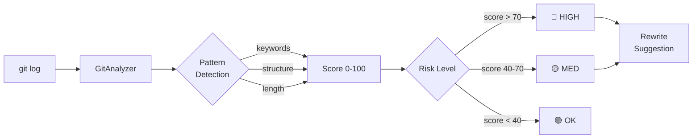

# gitorit

[](LICENSE)
[](https://python.org)
[](#testing)


CLI para auditar historial de git y detectar commits generados por IA.

## Cómo funciona



## ¿Qué hace?

Analiza tu historial de git y detecta commits con lenguaje característico de IA:
- Palabras: "enhancing", "comprehensive", "showcasing"
- Mensajes excesivamente largos (>200 caracteres)
- Patrones estructurales (listas largas, gerundios múltiples)

**Resultado**: Score 0-100 por commit, clasificación de riesgo, y sugerencias de reescritura siguiendo Conventional Commits.

---

## Instalación

```bash
git clone https://github.com/drhiidden/gitorit.git
cd gitorit
python3 -m venv venv
source venv/bin/activate
pip install -e .
```

O usa el script rápido:

```bash
./install.sh
source venv/bin/activate
```

---

## Uso Rápido

### Análisis completo

```bash
git-auditor analyze /path/to/repo
```

Muestra:
- Total de commits y período
- AI detection rate (total, high/medium/low risk)
- Peak activity (días con >10 commits)
- Top AI patterns detectados
- Velocity promedio

**Opciones útiles**:

```bash
# Modo verbose (muestra top 10 commits problemáticos)
git-auditor analyze /path/to/repo --verbose

# Exportar a Markdown
git-auditor analyze /path/to/repo --output=markdown --export=audit.md

# Exportar a JSON
git-auditor analyze /path/to/repo --output=json --export=audit.json

# Analizar branch específico
git-auditor analyze /path/to/repo --branch=feature/x
```

### Detectar commits con IA

```bash
git-auditor detect-ai /path/to/repo
```

**Opciones**:

```bash
# Threshold personalizado (0.0-1.0, default: 0.5)
git-auditor detect-ai /path/to/repo --threshold=0.3

# Mostrar patrones detectados
git-auditor detect-ai /path/to/repo --show-patterns

# Listar todos los commits analizados
git-auditor detect-ai /path/to/repo --list-all
```

### Timeline visual

```bash
git-auditor timeline /path/to/repo
```

**Opciones**:

```bash
# Con velocity chart
git-auditor timeline /path/to/repo --show-velocity

# Con risk heatmap
git-auditor timeline /path/to/repo --show-heatmap

# Todo junto
git-auditor timeline /path/to/repo --show-velocity --show-heatmap

# Agrupar por semana o mes
git-auditor timeline /path/to/repo --group-by=week
git-auditor timeline /path/to/repo --group-by=month
```

### Sugerencias de reescritura

```bash
git-auditor suggest-rewrites /path/to/repo
```

**Opciones**:

```bash
# Solo commits de alto riesgo (default)
git-auditor suggest-rewrites /path/to/repo --risk-level=high

# Incluir medium risk
git-auditor suggest-rewrites /path/to/repo --risk-level=all

# Preview before/after
git-auditor suggest-rewrites /path/to/repo --preview

# Exportar como script de rebase (¡revisar antes de ejecutar!)
git-auditor suggest-rewrites /path/to/repo --output=script --export=rebase.sh
```

---

## Ejemplo de Output

### Análisis del repo `human-code-ai-protocol` (160 commits)

```
╭─────────────────── Git Commit Audit Report ────────────────────╮
│ human-code-ai-protocol                                         │
│ Commits: 160 | Period: 2025-07-31 → 2026-03-29                 │
╰────────────────────────────────────────────────────────────────╯

AI Detection:
  Total: 129/160 (80.6%)
  🔴 High risk: 114 (71.2%)
  🟡 Medium risk: 15 (9.4%)
  🟢 Clean: 31 (19.4%)

Peak Activity:
  🔴 2026-03-28: 16 commits
  🔴 2026-02-01: 15 commits
  🔴 2026-03-17: 14 commits

Top AI Patterns:
  enhancing: 44
  clarity: 36
  comprehensive: 35
  usability: 26
```

### Timeline Visual

```
Timeline
================================================================================

2025-09-14 █████ (10) [AI: 6] 🔴
2026-02-01 ███████▌ (15) [AI: 10] 🔴
           Features: spanish, readme
2026-03-16 ███████ (14) [AI: 13] 🔴
           Features: clarify-first, multi-model
2026-03-28 ████████ (16) [AI: 6] 🔴

Legend: █ = 2 commits | 🔴 = Suspicious (≥10/period)

Risk Heatmap by Epoch
================================================================================

Period             LOW   MEDIUM   HIGH  Visual
--------------------------------------------------------------------------------
Sep 2025           20%      20%    60%  ████████████ 🔴
Dec 2025           15%      12%    74%  ██████████████ 🔴
Mar 2026           20%       6%    74%  ██████████████ 🔴
```

### Sugerencias de Reescritura

```
🔴 ae4d3d9 (2026-03-28) Score: 100
❌ docs: HCP v2.0 consolidation and professionalization

Major consolidation of documentation with comprehensive updates...
✅ docs: HCP v2.0 consolidation and professionalization

🔴 37fc3b4 (2026-03-17) Score: 100
❌ feat(cli-commands): implement core CLI commands for HCP, including init, get, list, search, annotate
✅ feat(cli-commands): implement core CLI commands for HCP
```

---

## Algoritmo de Detección

### Score 0-100

El score se calcula sumando puntos por:

1. **Longitud del mensaje**:
   - >100 chars: +20 puntos
   - >150 chars: +40 puntos
   - >200 chars: +70 puntos

2. **Palabras clave** (+10 por ocurrencia):
   - enhancing, comprehensive, showcasing
   - usability, clarity, functionality
   - detailing, facilitating, engagement
   - streamlining, optimizing

3. **Frases características** (+15 por ocurrencia):
   - "improving the", "detailing the"
   - "highlighting the", "enhancing user"
   - "showcasing best", "facilitating better"

4. **Patrones estructurales** (+25 por patrón):
   - Listas largas: "including X, Y, and Z"
   - Gerundios múltiples: "doing X; doing Y; doing Z"

### Clasificación de Riesgo

- 🟢 **0-30**: Low risk (commit limpio)
- 🟡 **31-60**: Medium risk (revisar recomendado)
- 🔴 **61-100**: High risk (reescritura recomendada)

---

## Workflows Recomendados

### Workflow 1: Auditoría Pre-Release

```bash
# 1. Analizar repo antes de release
git-auditor analyze . --verbose

# 2. Ver timeline para identificar epochs problemáticas
git-auditor timeline . --show-velocity --show-heatmap

# 3. Generar sugerencias para commits de alto riesgo
git-auditor suggest-rewrites . --risk-level=high --preview

# 4. Exportar reporte para revisión
git-auditor analyze . --output=markdown --export=pre-release-audit.md
```

### Workflow 2: Code Review de PR

```bash
# 1. Analizar branch específico
git-auditor detect-ai . --branch=feature/new-feature --show-patterns

# 2. Si hay AI detection, ver sugerencias
git-auditor suggest-rewrites . --branch=feature/new-feature --preview

# 3. Solicitar rewrites al autor si es necesario
```

### Workflow 3: Limpieza de Historial

```bash
# 1. Generar reporte completo
git-auditor analyze . --verbose --output=markdown --export=before-cleanup.md

# 2. Identificar commits a reescribir
git-auditor suggest-rewrites . --risk-level=high --preview > rewrites.txt

# 3. Planear estrategia (rebase interactivo, amend, etc.)

# 4. Después de limpieza, re-auditar
git-auditor analyze . --verbose --output=markdown --export=after-cleanup.md
```

---

## Mejores Prácticas para Commits

### ✅ Commits Limpios

```
feat(skills): add java security patterns
docs: update prompt taxonomy
fix(mcp): correct auth flow
refactor: consolidate duplicates
```

**Características**:
- 50-72 caracteres
- Conventional Commits format
- Verbos simples (add, update, fix, remove)
- Sin gerundios múltiples
- Sin palabras de marketing

### ❌ Commits Problemáticos

```
feat(tools): introduce comprehensive HCP Tools suite, including modules 
for annotations, metrics, code analysis, skill generation, and CLI; 
implement custom exceptions and auto-fix scripts for code quality issues
```

**Por qué es problemático**:
- >200 caracteres
- Múltiples gerundios (including, implement)
- Lista larga (annotations, metrics, analysis...)
- Palabras: comprehensive

---

## Demo

Ejecuta el demo interactivo para ver todos los comandos en acción:

```bash
./demo.sh
```

El demo analiza el repo `human-code-ai-protocol` mostrando:
1. Análisis completo
2. Detección de IA
3. Timeline visual
4. Sugerencias de reescritura
5. Exports a Markdown/JSON

---

## Stack Tecnológico

- **Python 3.11+**: Core
- **Click**: CLI framework
- **GitPython**: Git operations
- **Rich**: Terminal UI (tablas, paneles, colores)
- **Pydantic**: Data validation
- **Jinja2**: Templates para exports

---

## Desarrollo

### Setup

```bash
python3 -m venv venv
source venv/bin/activate
pip install -e ".[dev]"
```

### Tests

```bash
# Ejecutar tests
pytest

# Con coverage
pytest --cov=src/gitorit --cov-report=html

# Test específico
pytest tests/test_detector.py -v
```

### Linting

```bash
# Format
black src/ tests/

# Lint
ruff check src/ tests/

# Type check
mypy src/
```

---

## Estructura del Proyecto

```
gitorit/
├── src/gitorit/
│   ├── models.py       # Dataclasses (CommitAnalysis, Epoch, Report)
│   ├── detector.py     # AI detection algorithm
│   ├── rewriter.py     # Rewrite suggestions
│   ├── analyzer.py     # Core analysis engine
│   ├── timeline.py     # ASCII visualizations
│   └── cli.py          # CLI commands
│
├── tests/
│   ├── test_detector.py    # 9 tests
│   ├── test_rewriter.py    # 14 tests
│   ├── test_timeline.py    # 11 tests
│   └── test_models.py      # 6 tests
│
├── templates/
│   ├── report.md.j2        # Markdown template
│   └── dashboard.html.j2   # HTML template
│
├── pyproject.toml
├── requirements.txt
├── README.md           # Este archivo
├── CHANGELOG.md        # Historial de versiones
├── CONTRIBUTING.md     # Guía de contribución
├── LICENSE             # MIT
├── install.sh          # Script de instalación
└── demo.sh             # Demo interactivo
```

---

## Ayuda

```bash
# Ayuda general
git-auditor --help

# Ayuda de comando específico
git-auditor analyze --help
git-auditor detect-ai --help
git-auditor timeline --help
git-auditor suggest-rewrites --help
```

---

## Troubleshooting

**Error: "Not a valid git repository"**
- Verifica que el path contiene un directorio `.git/`
- Usa path absoluto: `/full/path/to/repo`

**Error: "No commits found"**
- Verifica el branch: `--branch=main` o `--branch=master`
- Verifica que el repo tiene commits: `git log --oneline`

**Performance lento con repos grandes**
- Analiza solo un branch: `--branch=feature-x`
- Usa threshold más alto en detect-ai: `--threshold=0.7`

**Threshold muy sensible/laxo**
- Threshold bajo (0.3): Detecta más commits, más falsos positivos
- Threshold alto (0.7): Detecta menos commits, solo los más obvios
- Default (0.5): Balance recomendado

---

## Licencia

MIT License - ver `LICENSE`

---

## Contribuir

Ver `CONTRIBUTING.md` para guía de contribución.

---

**Versión**: 0.1.0 | **Tests**: 40/40 passing | **Status**: Production Ready

---

## Metodología

Desarrollado con [HCP (Human-Code-AI Protocol)](https://github.com/haletheia/human-code-ai-protocol) — protocolo git-native para Context Engineering que mantiene el conocimiento del proyecto versionado y trazable.
