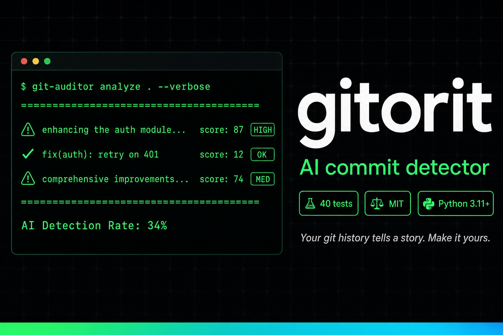

# gitorit

[](LICENSE)
[](https://python.org)
[](#testing)


**CLI para auditar historial de git y detectar commits generados por IA.**

Analiza tu historial de git y detecta commits con lenguaje característico de IA: palabras clave ("enhancing", "comprehensive"), mensajes largos (>200 chars), patrones estructurales (listas, gerundios múltiples).

**Resultado**: Score 0-100 por commit, clasificación de riesgo (🔴 HIGH / 🟡 MED / 🟢 OK), y sugerencias de reescritura siguiendo Conventional Commits.

---

## Quick Start

```bash
# Instalar
git clone https://github.com/drhiidden/gitorit.git
cd gitorit
./install.sh
source venv/bin/activate

# Auditar un repo
git-auditor analyze /path/to/repo --verbose

# Ver timeline visual
git-auditor timeline /path/to/repo --show-velocity

# Sugerencias de reescritura
git-auditor suggest-rewrites /path/to/repo --preview
```

---

## Características

- **4 comandos principales**: `analyze`, `detect-ai`, `timeline`, `suggest-rewrites`
- **Score 0-100**: Detecta keywords IA, longitud excesiva, patrones estructurales
- **Clasificación visual**: 🔴 High / 🟡 Medium / 🟢 Low risk
- **Timeline ASCII**: Heatmap de actividad y velocity
- **Sugerencias automáticas**: Reescritura siguiendo Conventional Commits

**Ver ejemplos detallados**: [AGENTS.md](AGENTS.md)

---

## Stack

Python 3.11+ · Click · GitPython · Rich · Pydantic

---

## Documentación

- **[AGENTS.md](AGENTS.md)** - Setup técnico paso a paso
- **[CHANGELOG.md](CHANGELOG.md)** - Historial de versiones
- **[CONTRIBUTING.md](CONTRIBUTING.md)** - Cómo contribuir

---

## Licencia

MIT - Ver [LICENSE](LICENSE)

---

**Metodología**: Desarrollado con [HCP (Human-Code-AI Protocol)](https://github.com/haletheia/human-code-ai-protocol)
